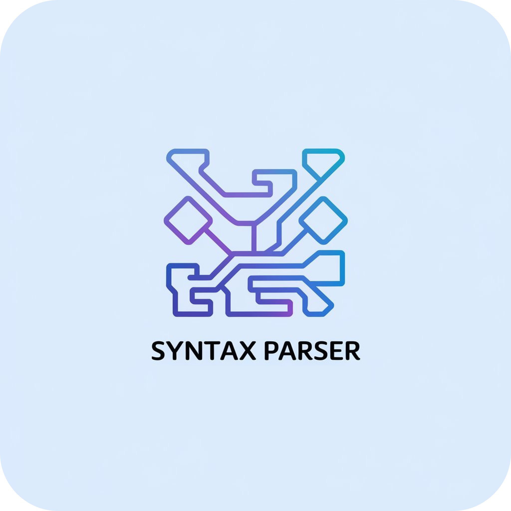

<p align="center">
    
</p>
            

<p align="center">
    <h1 align="center">ParseGen</h1>
</p>


<p align="center">
  
  
  
  
  
  
  
  
  
  
  
  
  
  
  
  
  
  
  
  
</p>
    

<p align="center">
    <em>Constructed using the following tools and technologies:</em>
</p>

<p align="center">
  
  
  
  
  
  
  
  

</p>

# Introduction

ParseGen is a web-based parser generator designed to facilitate the construction and analysis of parsers for Compiler Design courses. It supports CLR parsing techniques using context-free grammars. The application computes FIRST and FOLLOW sets, generates interactive parse trees, and constructs parsing tables, allowing users to test and validate grammars effectively.

The project comprises two main components:

- **Backend**: Implemented in Python using the Flask framework.
- **Frontend**: Developed with TypeScript using the Next.js framework at [https://github.com/Eemayas/ParseGen_Frontend](https://github.com/Eemayas/ParseGen_Frontend).

The live application is hosted at [parse-gen.vercel.app](https://parse-gen.vercel.app).
# Table of Contents
- [Introduction](#introduction)
- [Features](#features)
- [Folder Structure](#folder-structure)
- [Installation](#installation)
  - [Backend Setup](#backend-setup)
  - [Frontend Setup](#frontend-setup)
- [Usage](#usage)
- [Dependencies](#dependencies)
  - [Backend](#backend)
  - [Frontend](#frontend)
- [Documentation](#documentation)
- [Troubleshooting](#troubleshooting)
- [Contributing](#contributing)
  - [Contributing Guidelines](#contributing-guidelines)
- [Contributors](#contributors)
- [License](#license)


# Features

- **CLR and LL Parsing**: Supports both Canonical LR (CLR) and LL parsing methods.
- **Context-Free Grammar Support**: Allows users to input and analyze context-free grammars.
- **FIRST and FOLLOW Set Computation**: Automatically computes FIRST and FOLLOW sets for the provided grammar.
- **Interactive Parse Trees**: Generates interactive visualizations of parse trees.
- **Parsing Table Generation**: Constructs parsing tables to assist in the parsing process.
- **Grammar Testing**: Enables users to test and validate their grammars within the application.

# Folder Structure
```sh
ParseGen_Flask_Server/ 
├── README.md
├── question.png
├── templates/ 
│   └── hello.html
├── .gitignore
├── src/ 
│   ├── lr_item.py
│   ├── cannonical_lr_parser.py
│   ├── __init__.py
│   ├── main.py
│   └── app.py
├── app.py
├── requirements.txt
└── vercel.json

2 directories, 12 files
```

# Installation

To set up the ParseGen application locally, follow the steps below for both the backend and frontend components.

## Backend Setup

1. **Clone the Backend Repository**:
   ```bash
   git clone https://github.com/Eemayas/ParseGen_Flask_Server.git
   cd ParseGen_Flask_Server
   ```

2. **Create a Virtual Environment**:
   ```bash
   python3 -m venv venv
   source venv/bin/activate
   ```

3. **Install Dependencies**:
   ```bash
   pip install -r requirements.txt
   ```

4. **Run the Flask Application**:
   ```bash
   python app.py
   ```

   The backend server will start, typically accessible at `http://127.0.0.1:5000/`.

## Frontend Setup

1. **Clone the Frontend Repository**:
   ```bash
   git clone https://github.com/Eemayas/ParseGen_Frontend.git
   cd ParseGen_Frontend
   ```

2. **Install Dependencies**:
   ```bash
   npm install
   ```

3. **Configure Environment Variables**:

   Create a `.env.local` file in the root directory and add the following:

   ```env
   NEXT_PUBLIC_API_URL=http://127.0.0.1:5000
   ```

   Adjust the `NEXT_PUBLIC_API_URL` to match the backend server's URL if different.

4. **Run the Next.js Application**:
   ```bash
   npm run dev
   ```

   The frontend application will start, typically accessible at `http://localhost:3000/`.

# Usage

Once both the backend and frontend servers are running:

1. Navigate to `http://localhost:3000/` in your web browser.
2. Input your context-free grammar into the provided interface.
3. Utilize the features to compute FIRST and FOLLOW sets, generate parse trees, and construct parsing tables.
4. Test and validate your grammar using the interactive tools available.

# Dependencies

## Backend

- **Flask**: A lightweight WSGI web application framework in Python.
- **Other Python Packages**: Listed in `requirements.txt`.

## Frontend

- **Next.js**: A React framework for server-side rendering and static site generation.
- **TypeScript**: A statically typed programming language that builds on JavaScript.
- **Tailwind CSS**: A utility-first CSS framework for styling.
- **Other JavaScript Packages**: Listed in `package.json`.


# Documentation

For detailed documentation on the project's architecture, code structure, and development guidelines, please refer to the respective repositories:

- [Backend Repository](https://github.com/Eemayas/ParseGen_Flask_Server)
- [Frontend Repository](https://github.com/Eemayas/ParseGen_Frontend)


# Troubleshooting

If you encounter issues during setup or usage:

- **Backend Issues**:
  - Ensure all dependencies are installed correctly.
  - Verify that the Flask server is running and accessible at the specified URL.
  - Check for any error messages in the terminal where the Flask server is running.

- **Frontend Issues**:
  - Confirm that all npm packages are installed without errors.
  - Ensure the Next.js application is running and accessible at the specified URL.

For additional support, please open an issue in the respective GitHub repositories.

# Contributing

Contributions are welcome! Here are several ways you can contribute:

- **[Submit Pull Requests](https://github.com/Eemayas/ParseGen_Flask_Server/pulls)**: Review open PRs, and submit your own PRs.
- **[Join the Discussions](https://github.com/Eemayas/ParseGen_Flask_Server/discussions)**: Share your insights, provide feedback, or ask questions.
- **[Report Issues](https://github.com/Eemayas/ParseGen_Flask_Server/issues)**: Submit bugs found or log feature requests for ParseGen_Flask_Server.

### Contributing Guidelines

1. **Fork the Repository**:
    - Start by forking the project repository to your GitHub account.
2. **Clone the Repository**:
    - Clone your forked repository to your local machine using the command:
    ```sh
    git clone https://github.com/your-username/ParseGen_Flask_Server.git
    ```
    - Replace ``your-username`` with your GitHub username.
3. **Create a New Branch**:
    - Create a new branch for your changes using the command:
    ```sh
    git checkout -b your-branch-name
    ```
4. **Make Your Changes**:
    - Edit, add, or delete files as needed. Ensure your changes align with the project's contribution guidelines.
5. **Commit Your Changes**:
    - Stage your changes and commit them with a descriptive message:
      ```bash
      git add .
      git commit -m "Your descriptive message"
      ```
6. **Push Your Changes:**
    - Push your branch to your forked repository:
      ```bash
      git push origin your-branch-name
      ```
7. **Create a Pull Request (PR):**
    - Go to the original repository on GitHub and click “Compare & pull request.” Provide a clear description of the changes and submit the PR.

Once your PR is reviewed and approved, it will be merged into the main branch.

# Contributors

| Avatar | Contributor | GitHub Profile | No of Contributions |
|:--------:|:--------------:|:----------------:|:-------------------:|
|  | Eemayas | [@Eemayas](https://github.com/Eemayas) | 16 |
|  | earthPerson-001 | [@earthPerson-001](https://github.com/earthPerson-001) | 3 |
|  | Paribartan-Timalsina | [@Paribartan-Timalsina](https://github.com/Paribartan-Timalsina) | 1 |


# License
This project is licensed under the MIT License - see the [LICENSE](./LICENSE) file for details.
